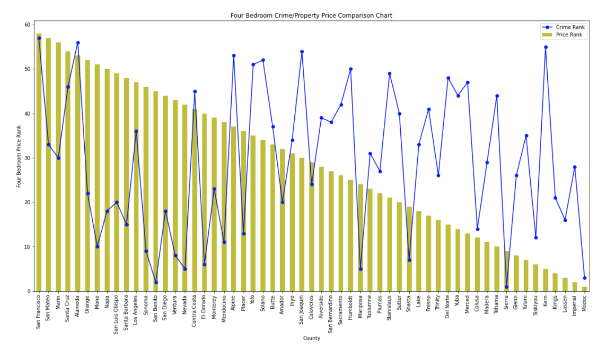

# CaliDream

## About the project

  The main goal of this project is to help figure out what county of California fit them most. There are many different factors like location, school rates, commute, neiborhod and more that people should consider to choose a rigth place to live. CaliDream team believe that price and safety is most important than other. 
  
## Team
Svetlana Akimova (@lanakimova) and Miguel Eamiguel (@52Godfrey)

## Data

1. Crime rates: 
    - [California Department of Justice](https://openjustice.doj.ca.gov/)
    - [Federal Bureau of Investigation](https://crime-data-explorer.fr.cloud.gov/)

2. House prices:
    - [Zillow](https://www.zillow.com/research/data/)

3. [Google maps API for easy visualisation](https://developers.google.com/maps/documentation)

## Results

  Working on this project we find out:
  
    - Than higher house price than lower crime rate with some exeption for San Francisco, Alameda and Contra Costa County
    - Than lower houses price and population than higer crime rate.
  
  We have statistics for all possibe bedroom choices, but we don't want to put to many pictures to Read.me file. There is one example to prove our conclusions:
  
  
  Format: 

  
  
